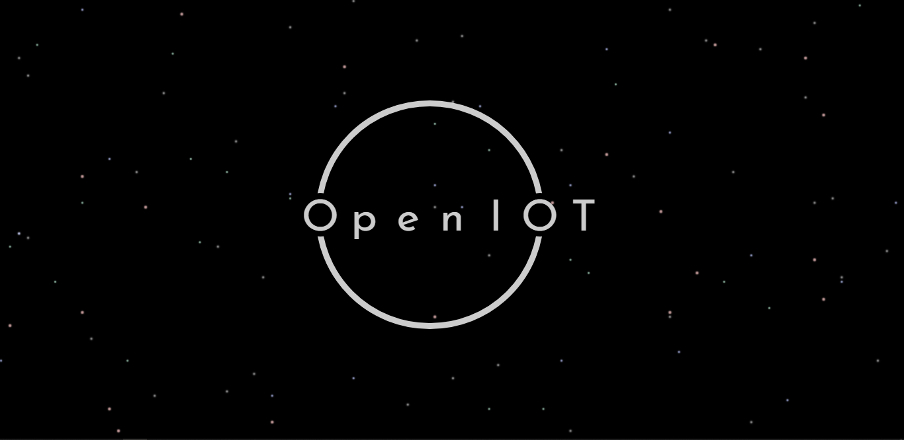

# OpenIOT Project Manager

UI software to help with easy management of your OpenIOT project. It is supposed to serve as an alternative for the cli (not a replacement ).

## Getting Started

These instructions will get you a copy of the source up and running on your local machine for development and testing purposes. See deployment for notes on how to deploy the project on a live system.

### Prerequisites

You need Nodejs v6.11.0+ and npm v3.10.10+ to be able to compile and the code.

### Installing

A step by step series of examples that tell you how to get a development env running

Clone the repository onto your local machine

```batch
git clone https://github.com/OpenSIOT/vue-theme.git
```

Install all dependencies

```batch
npm install
```

End with an example of getting some data out of the system or using it for a little demo

## Running the tests

Compile the vue components by running
```batch
npm run dev
```

Run the file *test/light.html* in your browser

Conversely, you can run
```batch
npm run watch
```

## Deployment

```batch
npm run prod
```

## Built With

* [Vue](https://vuejs.org) - The web framework used
* [NPM](https://npmjs.org/) - Dependency Management for NodeJS

## Authors

* **Bondzie Chris** - [github](https://github.com/BondzieChris)

## Contributors

* **Oppong-Sarpong Emmanuel** - *Initial work* - [github](https://sarps.github.io)

## License

This project is licensed under the MIT License - see the [LICENSE.md](LICENSE.md) file for details

## Acknowledgments

* Hat tip to anyone whose code was used
* Big ups to the founders of OpenIOT
* Kudos to the whole Open Source IOT Community
